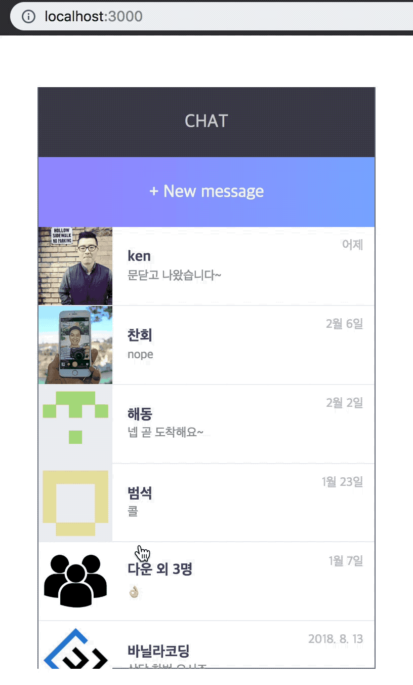

# Fake Chat Application

React & Redux를 이용해서 만든 가짜 채팅 어플리케이션입니다.



## Setup

Install dependencies

```sh
$ yarn install (or npm install)
```

## Development

```sh
$ yarn start (or npm start)
# visit http://localhost:3000
```

## Skills
- React
- React Router
- Redux
- Scss

## Features

- 채팅방 목록에서 리스트를 선택하면, 해당 사람과 채팅할 수 있는 화면이 표시됩니다.
- 채팅방 목록 리스트에는 상대방의 사진이 보여집니다.
- 채팅방 목록 리스트는 최신순으로 유지됩니다.
- 채팅 화면에서 메세지를 입력하면 채팅화면에 표시됩니다.
- 채팅 화면에서 채팅방 목록으로 돌아갈 수 있습니다.
